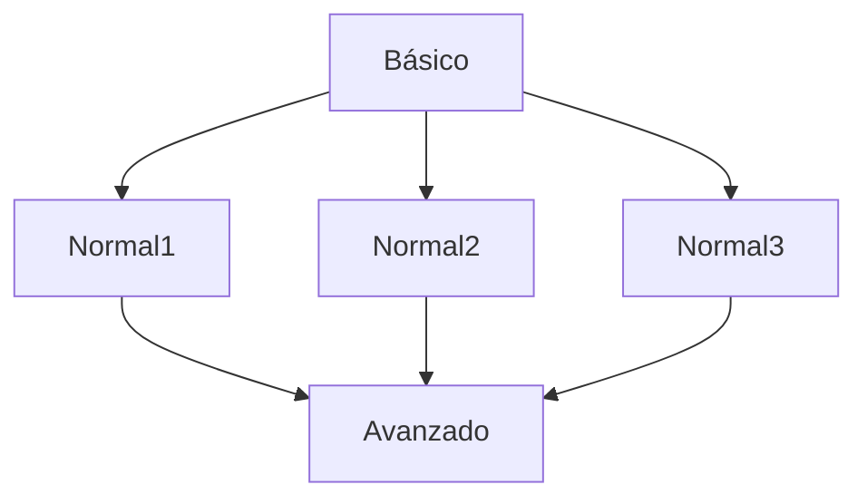

# **Proyecto de prueba de repositorio**
## ***<ins>Introducción</ins>***
### Aquí incluimos ficheros para aprender sobre le uso Git
#### Estudiamos Git para usarlo en proyectos de diseños web
- [x] Básico  
- [ ] Medio 
- [ ] Avanzado  
`prueba`
> block

