# **Proyecto de prueba de repositorio**
## ***<ins>Introducción</ins>***
### Aquí incluimos ficheros para aprender sobre le uso Git
#### Estudiamos Git para usarlo en proyectos de diseños web
- [x] Básico  
- [ ] Medio 
- [ ] Avanzado  
# 🎱  🥇  💯   
`prueba`  
Pincha aquí [GitHub](https://pages.github.com/)  
> block

```mermaid
 graph TD;
    **Básico**-->***Normal1***;
    **Básico**-->***Normal2***;
    **Básico**-->***Normal3***;
    ***Normal1***-->**Avanzado**;
    ***Normal2***-->**Avanzado**;
    ***Normal3***-->**Avanzado**;
```

